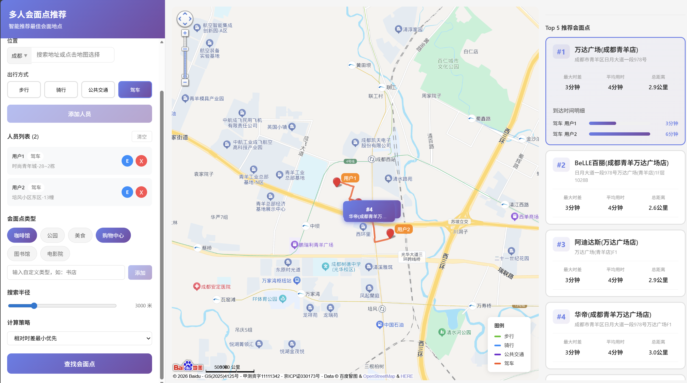

# 多人会面点智能推荐系统

基于百度地图 API 的多人会面点推荐应用，帮助多人快速找到最优会面地点。

## 功能特性

- 支持多人同时输入出发地点
- 支持多种出行方式：步行、骑行、驾车、公共交通
- 智能推荐最优会面点，最小化所有人到达时间差异
- 地图可视化展示各人路线
- 支持按类型筛选会面点（餐厅、咖啡馆、公园等）
- 支持调节搜索半径
- 提供多种计算策略（默认推荐/相对时差最小/相对距离差最小）
- IP 定位自动获取当前城市
 

## AI 模块简介

AI 决策助手会在候选点生成后给出更贴近日常沟通的推荐说明，结合路况、天气适配性与口碑因素输出建议，帮助快速定案。

**能力要点**
- 结合候选点通行时间与拥堵程度，优先推荐通行更顺畅的位置
- 结合天气与场景匹配度，提示室内商圈、近地铁或停车便利等优势
- 兼顾口碑与品牌稳定性，让推荐更可靠、可执行

**输出形式**
- 在前端以卡片形式展示
- 使用自然、专业的文字表达，便于直接沟通
## 项目结构

```
.
├── 1Planning.png
├── 2ai decision.png
├── meeting-point-recommender/
│   ├── backend/                 # 后端服务
│   │   ├── src/
│   │   │   ├── app.js           # Express 应用入口
│   │   │   ├── config/          # 配置文件
│   │   │   ├── controllers/     # 控制器
│   │   │   ├── routes/          # 路由
│   │   │   ├── services/        # 业务逻辑
│   │   │   └── utils/           # 工具函数
│   │   └── package.json
│   ├── frontend/                # 前端应用
│   │   ├── src/
│   │   │   ├── components/      # React 组件
│   │   │   ├── services/        # API 服务
│   │   │   ├── App.jsx          # 主应用组件
│   │   │   └── main.jsx         # 入口文件
│   │   └── package.json
│   ├── 1Planning.png
│   ├── 2ai decision.png
│   ├── 3 city map.png
│   ├── 4default-user.png
│   ├── screenshot.png
│   ├── screenshot2.png
│   ├── screenshot3.png
│   ├── screenshot4.png
│   ├── screenshot7.png
│   └── screenshot8.png
├── package-lock.json
└── README.md
```

## 技术栈

**前端：**
- React 18
- Vite
- 百度地图 JavaScript API

**后端：**
- Node.js
- Express
- 百度地图 Web 服务 API

## 快速开始

### 环境要求

- Node.js >= 16
- npm >= 8

### 配置

1. 后端配置：在 `meeting-point-recommender/backend/` 目录下创建 `.env` 文件：

```env
BMAP_SERVER_KEY=your_baidu_server_api_key
PORT=3001
```

2. 前端配置：在 `meeting-point-recommender/frontend/` 目录下创建 `.env` 文件：

```env
VITE_BMAP_WEB_KEY=your_baidu_browser_api_key
VITE_API_URL=http://localhost:3001/api
```

### 安装依赖

```bash
# 后端
cd meeting-point-recommender/backend
npm install

# 前端
cd meeting-point-recommender/frontend
npm install
```

### 启动服务

```bash
# 启动后端（端口 3001）
cd meeting-point-recommender/backend
node src/app.js

# 启动前端（端口 5173）
cd meeting-point-recommender/frontend
npm run dev
```

访问 http://localhost:5173 即可使用。

## 使用说明

1. 添加参与会面的人员信息（姓名、出发地点、出行方式）
2. 选择会面点类型与搜索半径（可选）
3. 选择计算策略（默认推荐/相对时差最小/相对距离差最小）
4. 点击"寻找会面点"按钮
5. 系统自动计算并推荐最优会面点
6. 在地图上查看各人路线和会面点位置
7. 点击"AI 自动决策"获取推荐说明卡片

## API 密钥申请

需要在 [百度地图开放平台](https://lbsyun.baidu.com/) 申请两个应用：

1. **浏览器端应用**：用于前端地图展示
2. **服务端应用**：用于后端路径规划和 POI 搜索

## 算法说明

会面点推荐算法采用加权中心点 + 多维度评分机制（默认推荐）：

- 时间方差权重：40%
- 最大时间差权重：30%
- 平均到达时间权重：20%
- 总距离权重：10%

另提供两种可选策略：

- 相对时差最小优先：最小化“最大时长与最小时长的相对差距”
- 相对距离差最小优先：最小化“最大距离与最小距离的相对差距”

## License

MIT
