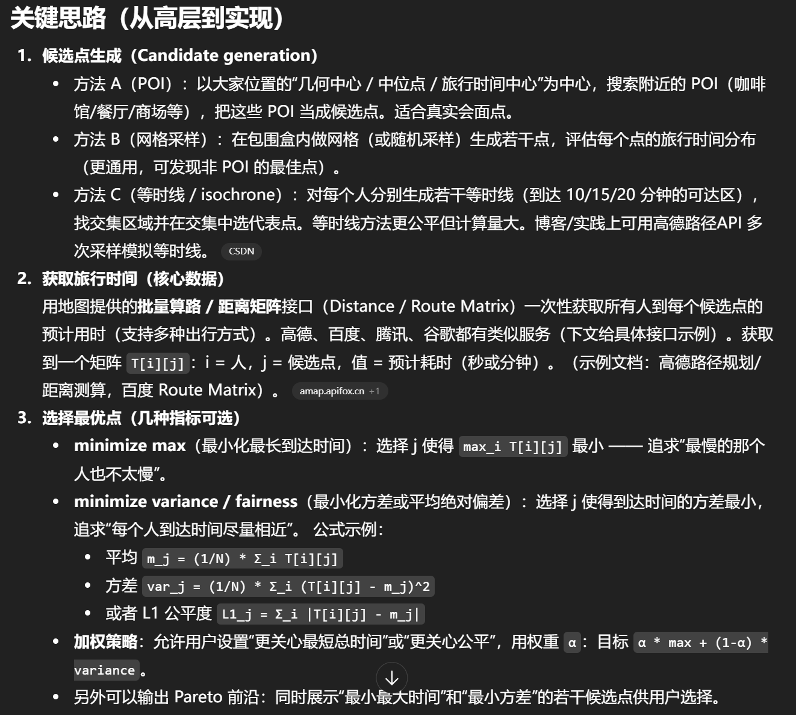
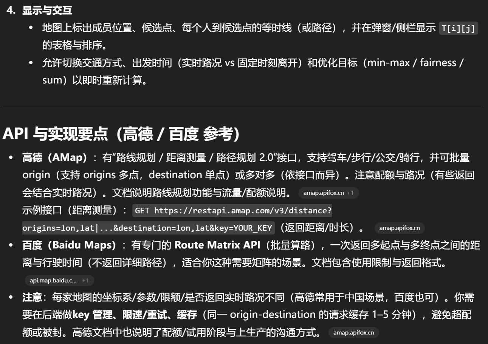

<h1 style="color: yellow;">Hackson-project</h1>
Demo
==========
概览（要解决的问题）
------------

目标：给定 N人的当前位置 + 出行方式（步行/驾车/公交/骑行）＋出发时间，自动找出一个或若干“候选会面点”，使得每个人到该点的通勤时间差异较小（比如到达时长接近、或最大到达时间最小化），并在真实地图上显示（用高德/百度地图 API 做路由/时间估算和可视化）。

当前进展
=============
目前已经申请到了高德和百度的api，每天配额5000。我在apitest里测试了百度的，是ok的。大家也可以自行运行一下，一天5000次应该还是够用
PS：
----------
百度用的是百度坐标系，和高德的火星坐标系不一样，记得注意一下，不过百度好像只是坐标转换
好像要交互得用浏览器api，要规划之类的要用服务端api