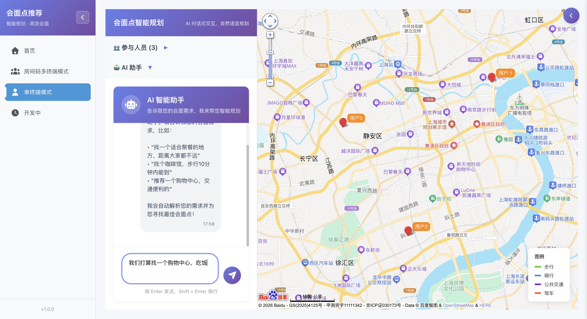
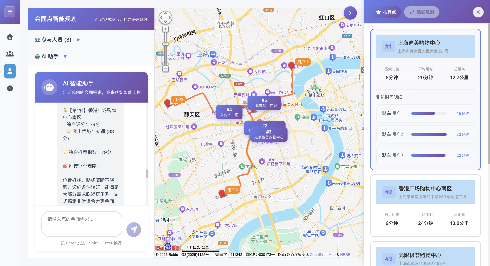
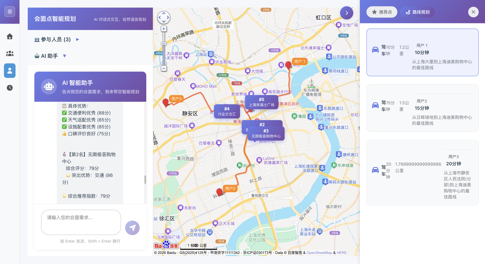

# 多人会面点智能推荐系统

基于百度地图 API 的多人会面点推荐应用，帮助多人快速找到最优会面地点。

## 功能特性

- 支持多人同时输入出发地点
- 支持多种出行方式：步行、骑行、驾车、公共交通
- 智能推荐最优会面点，最小化所有人到达时间差异
- 地图可视化展示各人路线
- 支持按类型筛选会面点（餐厅、咖啡馆、公园等）
- 支持调节搜索半径
- 提供多种计算策略（默认推荐/相对时差最小/相对距离差最小）
- IP 定位自动获取当前城市
- **多页面路由**：首页、单终端模式、房间码多终端模式、开发中页面
- **可折叠侧边栏**：平滑展开/收起，节省可视空间
- **AI 对话输入**：支持自然语言描述需求，AI 解析并执行搜索

  

## AI 模块简介

AI 决策助手会在候选点生成后给出更贴近日常沟通的推荐说明，结合路况、天气适配性与口碑因素输出建议，帮助快速定案。

**能力要点**
- 结合候选点通行时间与拥堵程度，优先推荐通行更顺畅的位置
- 结合天气与场景匹配度，提示室内商圈、近地铁或停车便利等优势
- 兼顾口碑与品牌稳定性，让推荐更可靠、可执行

**输出形式**
- 在前端以卡片形式展示
- 使用自然、专业的文字表达，便于直接沟通

## 项目结构

```
.
├── 1.png
├── 2.png
├── 3.png
├── meeting-point-recommender/
│   ├── backend/                      # 后端服务
│   │   ├── src/
│   │   │   ├── app.js                # Express 应用入口
│   │   │   ├── config/               # 配置文件
│   │   │   ├── controllers/          # 控制器
│   │   │   ├── routes/               # 路由
│   │   │   ├── services/             # 业务逻辑（地图、算法、AI 决策等）
│   │   │   └── utils/                # 工具函数
│   │   └── package.json
│   └── frontend/                     # 前端应用
│       ├── src/
│       │   ├── components/
│       │   │   ├── Layout/           # 侧边栏、主布局
│       │   │   ├── Map/              # 地图容器
│       │   │   ├── Pages/            # 首页、单终端、多终端、开发中
│       │   │   ├── UserInput/        # 人员输入表单
│       │   │   ├── Result/           # 会面点卡片、AI 决策卡片
│       │   │   └── Chat/             # AI 对话输入框
│       │   ├── services/             # API、路由、地图、AI 解析服务
│       │   ├── App.jsx               # 主应用（路由容器）
│       │   └── main.jsx              # 入口文件
│       ├── package.json
│       ├── 重构完成报告.md
│       └── 快速开始.md
└── README.md
```

## 页面与路由

| 路径 | 页面 | 说明 |
|------|------|------|
| `#/home` | 首页 | 数据概览、快捷操作、最近会面记录 |
| `#/single-terminal` | 单终端模式 | 完整会面点推荐功能（原有核心功能） |
| `#/multi-terminal` | 房间码多终端模式 | 创建/加入协作房间（开发中） |
| `#/developing` | 开发中 | 占位页面 |

## 技术栈

**前端：**
- React 19
- Vite
- Font Awesome
- 百度地图 JavaScript API
- 原生 Hash 路由（无需 react-router）

**后端：**
- Node.js
- Express
- 百度地图 Web 服务 API

## 快速开始

### 环境要求

- Node.js >= 16
- npm >= 8

### 配置

1. 后端配置：在 `meeting-point-recommender/backend/` 目录下创建 `.env` 文件：

```env
BMAP_SERVER_KEY=your_baidu_server_api_key
PORT=3001
BMAP_WEATHER_DISTRICT_ID=222405
```

2. 前端配置：在 `meeting-point-recommender/frontend/` 目录下创建 `.env` 文件：

```env
VITE_BMAP_WEB_KEY=your_baidu_browser_api_key
VITE_API_URL=http://localhost:3001/api
```

### 安装依赖

```bash
# 后端
cd meeting-point-recommender/backend
npm install

# 前端
cd meeting-point-recommender/frontend
npm install
```

### 启动服务

```bash
# 启动后端（端口 3001）
cd meeting-point-recommender/backend
npm start

# 启动前端（端口 5173）
cd meeting-point-recommender/frontend
npm run dev
```

访问 http://localhost:5173 即可使用。

## 使用说明

1. 从左侧边栏选择 **单终端模式** 进入会面点推荐功能
2. 添加参与会面的人员信息（姓名、出发地点、出行方式）
3. 选择会面点类型与搜索半径（可选）
4. 选择计算策略（默认推荐/相对时差最小/相对距离差最小）
5. 点击「寻找会面点」按钮
6. 系统自动计算并推荐最优会面点
7. 在地图上查看各人路线和会面点位置
8. 点击「AI 自动决策」获取推荐说明卡片
9. 或使用 AI 对话框通过自然语言描述需求进行搜索

**侧边栏**：点击顶部折叠按钮可收起/展开，折叠后仅显示图标。

## API 密钥申请

需要在 [百度地图开放平台](https://lbsyun.baidu.com/) 申请两个应用：

1. **浏览器端应用**：用于前端地图展示
2. **服务端应用**：用于后端路径规划和 POI 搜索

## 算法说明

会面点推荐算法采用加权中心点 + 多维度评分机制（默认推荐）：

- 时间方差权重：40%
- 最大时间差权重：30%
- 平均到达时间权重：20%
- 总距离权重：10%

另提供两种可选策略：

- 相对时差最小优先：最小化「最大时长与最小时长的相对差距」
- 相对距离差最小优先：最小化「最大距离与最小距离的相对差距」

## License

MIT
